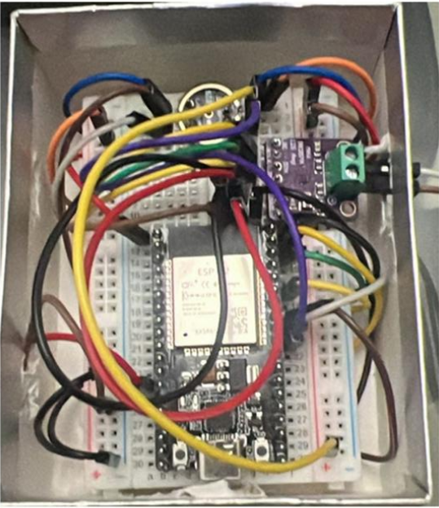
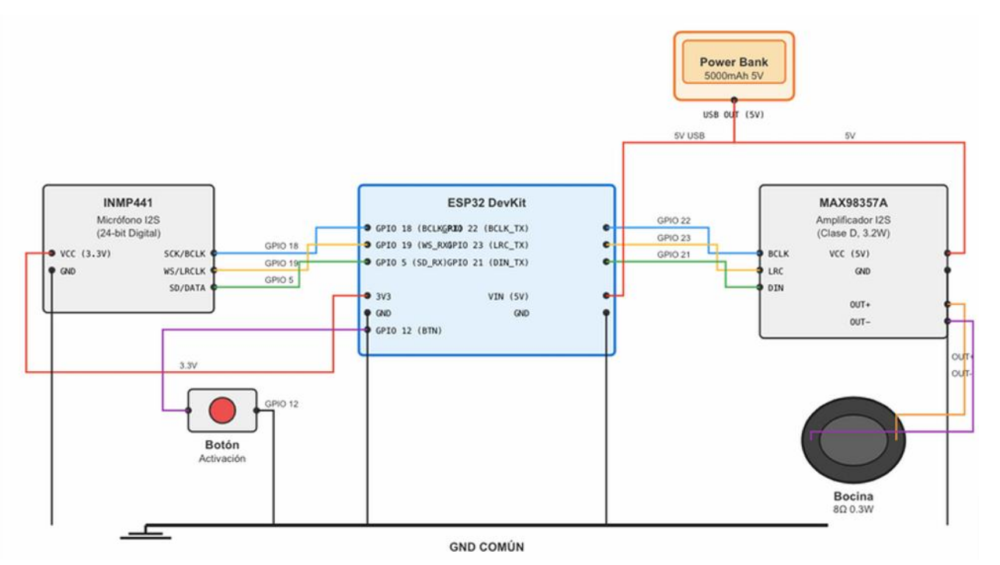

# 🦊 Mr. Zorro - Asistente de Voz ESP32

Este proyecto implementa un asistente de voz en un microcontrolador ESP32. Se integra con una aplicación móvil a través de Bluetooth Low Energy (BLE) para la autenticación del usuario y se comunica con un backend en Python (FastAPI) para el procesamiento de voz y respuestas de IA.

## 📄 Documentación del proyecto

- **Documentación técnica**: [Mr. Zorro](.resources/docs/Documentacion_MrZorro.pdf)

## 🔗 Repositorios

Este proyecto es parte de un ecosistema más grande. Revisa los otros repositorios de sus componentes:

- **Flutter APP**: [mrzorro_app](https://github.com/jorgemp1270/mrzorro_app)
- **Backend API**: [mrzorro_api](https://github.com/jorgemp1270/mrzorro_api)

## Características

<p align="center">
  
</p>

*   **Emparejamiento BLE:** Se conecta a una aplicación móvil para recibir un ID de usuario de forma segura.
*   **Grabación de Voz:** Captura audio utilizando un micrófono I2S (INMP441).
*   **Transmisión de Audio:** Envía datos de audio en fragmentos a un servidor backend a través de HTTP POST.
*   **Reproducción de Audio:** Descarga y reproduce respuestas de audio WAV generadas por el backend utilizando un amplificador I2S (MAX98357A).
*   **Indicación de Estado:** Utiliza el LED incorporado para indicar el estado de grabación.

## Requisitos de Hardware

*   **Microcontrolador:** Placa de desarrollo ESP32 (por ejemplo, ESP32 DOIT DEVKIT V1)
*   **Micrófono:** INMP441 (Interfaz I2S)
*   **Amplificador:** MAX98357A (Interfaz I2S)
*   **Altavoz:** Altavoz de 4Ω u 8Ω
*   **Entrada:** Botón pulsador
*   **Fuente de Alimentación:** 5V USB o Batería

## Esquema y Configuración de Pines

<p align="center">
  
</p>

| Componente | Nombre del Pin | GPIO ESP32 | Descripción |
| :--- | :--- | :--- | :--- |
| **INMP441** | SCK | 18 | Reloj Serial |
| (Micrófono) | WS | 19 | Selección de Palabra |
| | SD | 5 | Datos Seriales |
| | VDD | 3.3V | Alimentación |
| | GND | GND | Tierra |
| | L/R | GND | Selección de Canal Izquierdo |
| **MAX98357A** | BCLK | 22 | Reloj de Bit |
| (Altavoz) | LRC | 23 | Reloj Izquierda/Derecha |
| | DIN | 21 | Entrada de Datos |
| | VIN | 5V | Alimentación |
| | GND | GND | Tierra |
| **Botón** | Pin 1 | 12 | Entrada (Pull-up) |
| | Pin 2 | GND | Tierra |
| **LED** | Ánodo | 2 | LED Incorporado (Estado) |

## Dependencias de Software

Este proyecto está construido utilizando **PlatformIO** con el **Framework Arduino**.

**Librerías Requeridas:**
*   `WiFi` (Integrada)
*   `HTTPClient` (Integrada)
*   `BLEDevice` / `ESP32 BLE Arduino` (Integrada)
*   `ArduinoJson` (por Benoit Blanchon)

## Instalación

1.  **Instalar VS Code:** Descarga e instala Visual Studio Code.
2.  **Instalar PlatformIO:** Instala la extensión "PlatformIO IDE" desde el marketplace de VS Code.
3.  **Clonar Repositorio:** Clona este repositorio en tu máquina local.
4.  **Abrir Proyecto:** Abre la carpeta del proyecto en VS Code. PlatformIO detectará el archivo `platformio.ini` y descargará automáticamente las dependencias necesarias.

## Configuración

Antes de subir el código, actualiza las siguientes constantes en `src/main.cpp`:

```cpp
// Credenciales WiFi
const char *ssid = "TU_SSID_WIFI";
const char *password = "TU_CONTRASEÑA_WIFI";

// Configuración del Backend
const char *serverIP = "TU_IP_BACKEND"; // ej., 192.168.1.X
const int serverPort = 8000;
```

## Uso

1.  **Subir Firmware:** Conecta el ESP32 a tu PC y sube el código usando PlatformIO (botón de flecha "Upload").
2.  **Encender:** El ESP32 se inicializará y esperará una conexión BLE.
3.  **Conectar App:** Abre la aplicación complementaria Flutter y conéctate al dispositivo Bluetooth llamado **"ESP32_MrZorro"**.
4.  **Autenticar:** La aplicación envía el `userId` al ESP32.
5.  **Grabar Comando:**
    *   **Mantén presionado** el botón (GPIO 12) para comenzar a grabar. El LED se encenderá.
    *   Habla tu comando claramente.
    *   **Suelta** el botón para detener la grabación. El LED se apagará.
6.  **Procesamiento:** El ESP32 envía el audio al servidor.
7.  **Respuesta:** Una vez procesado, el ESP32 descargará y reproducirá la respuesta de la IA a través del altavoz.

## API del Backend

El ESP32 espera un servidor backend con los siguientes endpoints:

*   `POST /audio`: Recibe fragmentos de audio (octet-stream). Encabezados: `X-Chunk-Number`, `X-Last-Chunk`, `X-User-Id`.
*   `GET /get_response/{filename}`: Devuelve el archivo de audio WAV generado.

----

Desarrollado con ♥️ usando PlatformIO y Arduino IDE
